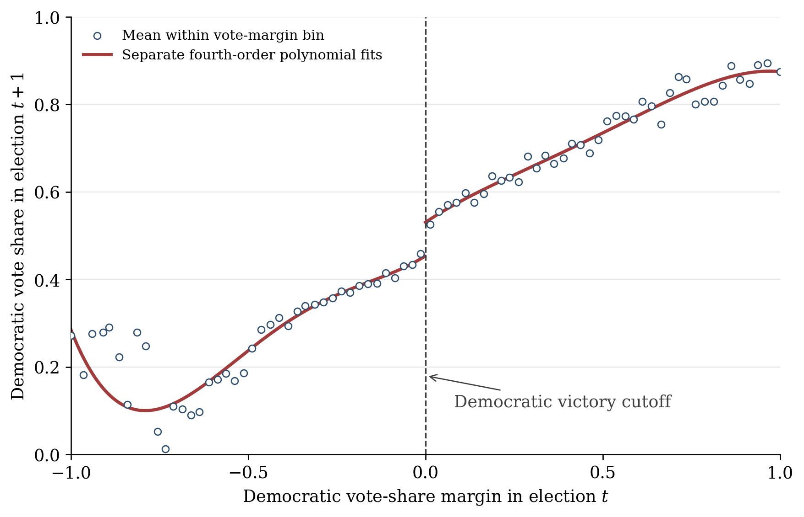

This page accompanies Chapter 8. R runs inside your browser, so the classroom
computer does not need a local R installation. The first execution may take a
moment while WebR downloads the chapter's package.

## A discontinuity we know by construction

The data-generating process below has a jump of 10 at zero. Change the
bandwidths and compare the estimates.

```{webr}
library(rdd)

set.seed(5280)
x <- runif(1000, -1, 1)
y <- 3 + 2 * x + 10 * (x >= 0) + rnorm(1000)

fit_auto <- RDestimate(y ~ x)
fit_grid <- RDestimate(
  y ~ x,
  bw = c(0.10, 0.20, 0.30),
  kernel = "gaussian"
)

summary(fit_auto)
summary(fit_grid)
plot(fit_auto)
```

Questions to consider:

1. Which estimate is closest to the true jump of 10?
2. What happens to the standard error when the bandwidth becomes smaller?
3. Does a larger bandwidth visibly strain the local linear approximation?

## Lee-style U.S. House election data

The course data contain the Democratic vote-share margin in election $t$ and
the Democratic vote share in election $t+1$. The relative path below is from
this chapter page to the shared course data directory.

```{webr}
library(rdd)

house <- read.csv("data/house.csv")
str(house)
summary(house)

lee_local <- RDestimate(y ~ x, data = house)
summary(lee_local)
plot(lee_local)
```

The published PDF includes a reproducibly reconstructed binned-scatter figure.
The polynomial curves in that figure are descriptive; use the local estimate
above for the primary RD analysis.

{width=95%}
