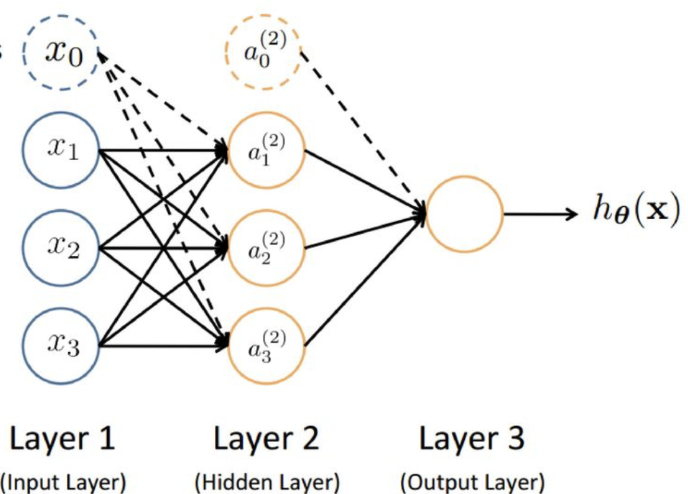

This browser lab keeps the network deliberately small. It illustrates function
approximation without requiring a local R installation or a GPU.

{width=78%}

## A sigmoid approximation to a binary maximum

For binary inputs, $\max\{x_1,x_2\}$ is the logical OR function.

```{webr}
sigmoid <- function(z) 1 / (1 + exp(-z))

grid <- expand.grid(x1 = c(0, 1), x2 = c(0, 1))
grid$truth <- pmax(grid$x1, grid$x2)
grid$network <- with(grid, sigmoid(-20 + 40 * x1 + 40 * x2))
grid
```

The coefficients are not estimated here; they are chosen to show how a smooth
sigmoid can approximate a threshold-like function.

## Learn a nonlinear conditional mean

The true regression function is
$m(W_1,W_2)=\sin(\pi W_1)+W_2^2$. We compare a small one-hidden-layer network
with a misspecified additive linear model on held-out observations.

```{webr}
library(nnet)

set.seed(5280)
n <- 700
W1 <- runif(n, -1, 1)
W2 <- runif(n, -1, 1)
m <- sin(pi * W1) + W2^2
Y <- m + rnorm(n, sd = 0.25)
dat <- data.frame(Y, W1, W2)

train <- sample(seq_len(n), 500)
test <- setdiff(seq_len(n), train)

fit_nn <- nnet(
  Y ~ W1 + W2,
  data = dat[train, ],
  size = 8,
  linout = TRUE,
  decay = 0.01,
  maxit = 500,
  trace = FALSE
)
fit_lm <- lm(Y ~ W1 + W2, data = dat[train, ])

pred_nn <- predict(fit_nn, dat[test, ])
pred_lm <- predict(fit_lm, dat[test, ])

c(
  neural_net = mean((Y[test] - pred_nn)^2),
  linear_model = mean((Y[test] - pred_lm)^2)
)
```

## Inspect predictions along one slice

```{webr}
slice <- data.frame(W1 = seq(-1, 1, length.out = 150), W2 = 0.5)
slice$truth <- with(slice, sin(pi * W1) + W2^2)
slice$neural_net <- predict(fit_nn, slice)
slice$linear_model <- predict(fit_lm, slice)

plot(slice$W1, slice$truth, type = "l", lwd = 3,
     xlab = "W1 (holding W2 = 0.5)", ylab = "Conditional mean")
lines(slice$W1, slice$neural_net, col = 2, lwd = 2)
lines(slice$W1, slice$linear_model, col = 4, lwd = 2, lty = 2)
legend("topleft", c("Truth", "Neural net", "Linear model"),
       col = c(1, 2, 4), lwd = c(3, 2, 2), lty = c(1, 1, 2), bty = "n")
```

This exercise evaluates prediction. A flexible predictor becomes a causal tool
only when it is embedded in a credible identification strategy.
